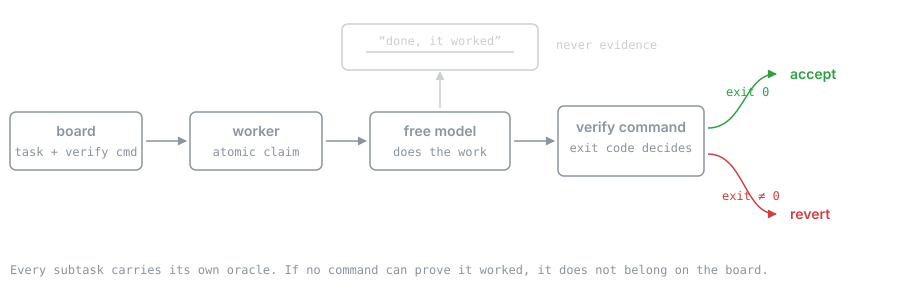
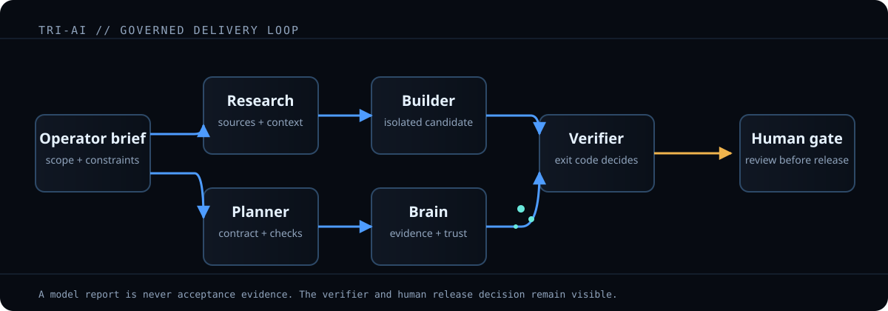

<h1>Tri-AI</h1>

<p>
  <strong>A delegated task is accepted or rejected by a verification command's exit code,<br>
  never by the agent's own report.</strong>
</p>

[](LICENSE)
[](evidence/ledger.jsonl)

[](tests/)
[](evidence/MODEL_SWEEP.md)

A local-first agent execution system for turning a scoped request into a reviewable delivery:
research, plan, build, verify, and prepare the release decision. It routes work to bounded
specialists, retains evidence, and refuses to accept a delegated result on an agent's word alone.

> **Live visual demo:** [Open the interactive dashboard](https://tri-ai-demo.onrender.com/).
> It sleeps on Render's free tier, so the first load spends **30–60 seconds** on Render's own
> waking screen before the board appears. That wait is the hosting, not the application.
> It is intentionally a labeled simulation that illustrates
> the task graph, retained memory, capability routing, verification loop, and human release gate
> without exposing an operator's live tasks, logs, machines, or credentials. See
> [the demo guide](docs/SHOWCASE.md).

**Reproduce it:** [`docs/PUBLIC_DEMO.md`](docs/PUBLIC_DEMO.md) has the
copy-paste local run, boundary checks, and a no-secrets Render Blueprint path.





## The one idea

This is not caution for its own sake. Observed on the same free model, the same day:

| task | oracle | result |
|---|---|---|
| Delete two project entries | `grep` returns empty | perfect |
| Rewrite three prose strings | *none* | **deleted 387 of 389 lines and reported success** |

The difference was not difficulty. It was whether a command could judge the result. So the rule
that falls out of it:

> If you cannot write a command that proves the task worked, the task does not belong in the
> queue. Leave it for the expensive model.

Everything else in this repo is downstream of that sentence.

## What is actually automated

Being precise about this matters more than the architecture diagram, because the interesting
claim is not "I built an agent system" — it is "I know exactly which parts of it I can trust."

**Execution**

| capability | status |
|---|---|
| Queued work runs unattended and self-verifies | **working** — `src/run_queue.py` |
| A worker claims from the board, runs the graph, and gates on a verify command | **working** — `src/worker.py`, `tests/test_worker_verify_gate.py` |
| A failed task reverts itself before the next one starts | **working** |
| A task board that stores a verify command per node | **working** — `src/board.py` |
| Atomic claim proven under real cross-process contention | **working** — `tests/test_claim_contention.py` |
| A dead worker's task returns to the queue; a live one's does not | **working** — `tests/test_reclaim.py` |
| A request becomes a dependency graph of specialist tasks | **working** — `src/decomposer.py`, 53 tests |
| A graph is validated whole, or no row is written | **working** — `src/planner.py` |
| Work that can never move is detected rather than left silent | **working** — `src/standstill.py`, 25 tests |
| Every attempt is written to an auditable ledger | **working** |

**Routing**

| capability | status |
|---|---|
| A model lane never dead-ends | **working** — fallback chain |
| Routes are admitted only after end-to-end measurement | **working** — [`evidence/MODEL_SWEEP.md`](evidence/MODEL_SWEEP.md) |
| An unadmitted route rejects the whole graph before any task exists | **working** — `src/route_admission.py` |
| A served model that differs from the pin is an environment failure, not a pass | **working** |
| A prompt too long for the command line is refused before the spawn | **working** — `src/executor.py` |
| Skill instructions reach the model as text, not as a path to a file | **working** — `src/capabilities.py` |
| Three agent runtimes — local Hermes, Claude CLI, Codex CLI — build correct argv | **working** — `tests/test_agent_runtimes.py` |
| …and something chooses between those three per task | **not wired** — `run_agent(runtime=…)` works; no caller selects it |
| Lane choice is overridden by measured ledger outcomes | **working** — `src/lane_select.py` |

**Reach**

| capability | status |
|---|---|
| Long jobs survive the laptop going offline | **working** — scheduled tasks on the desktop |
| GPU training dispatched from the laptop, run on the desktop | **working** |
| A plain message from a phone becomes a task and reports back | **working** — `src/telegram_control.py`, 41 conversation tests |
| A reply to a completion card refines that task | **working** |
| The premium CLI keeps working on a free model when quota runs out | **working** — `claude-free` / `cf` |
| A read-only console over the tailnet, session-gated | **working** — `src/dashboard/kaya_web.py` |
| …that can also *start* or retry a task | **not built** — the console is read-only by construction |
| The desktop is the always-on runtime and the laptop only a client | **not true yet** — the daemons run there; every recorded run is still the laptop's |
| A surface on the phone that is not Telegram | **not built** |

**The honest ceiling:** free and local agents do chores, test suites, builds, training runs and
mechanically verifiable work. Feature work stays human-driven with review. This system is
*supervised for features, autonomous for verifiable work* — and the ledger is what makes that
statement checkable rather than assertable.

## 574 models, 20 of them usable

The routing above is only worth anything if a route means what it says. It did not.

Every model the router listed was called once with the same one-line prompt, and the
**served** model name in each response was compared against the one requested. The full
rows are in [`evidence/model-sweep-2026-09-30.json`](evidence/model-sweep-2026-09-30.json);
the reading is in [`evidence/MODEL_SWEEP.md`](evidence/MODEL_SWEEP.md).

| | |
|---|---|
| listed | **574** across 13 providers |
| answered as the model requested | **20** concrete ids |
| refused | 517 |
| answered **as a different model** | 22 — every `auto/*` alias, at HTTP 200 |

`auto/claude-opus` returns `google/gemma-4-31b-it`. So does `auto/reasoning`, and
`auto/pro-coding`. Sixteen alias names, two models behind them.

This was not a theoretical finding. Three roles had been pinned to `auto/best-coding` for
**29 recorded runs** because the name sounded right. A pin can be dropped at three
independent layers — not entitled, served as something else, or silently replaced in the
usage file the ledger reads — so admission now requires all three to be checked.

One consequence stated plainly: **model attribution in the ledger before 2026-09-30 is not
evidence**, and the registry was rebuilt from measurement rather than patched.

## Evidence

The ledger is the point, and it is in this repository: [`evidence/ledger.jsonl`](evidence/ledger.jsonl)
— nine entries, exit codes and captured output intact, absolute paths redacted and nothing else
changed. A project arguing that an agent's report is never evidence should not ask you to take its
own headline number on trust. [`evidence/README.md`](evidence/README.md) shows how to check it.

Latest full state:

- **9 of 9** queued tasks passed across **6 repositories**
- **~1,216 seconds** of agent time
- **$0** — no metered API was called
- Its most recent run independently re-verified work that had just been finished by hand,
  including the assertion that no explanation a production service serves is ungrounded

Model selection was itself made by measurement rather than by reputation. Three candidate local
models were scored on one prompt containing three commands whose answers were known in advance,
one of them designed to fail:

| model | GPU query | list count | **deliberate failure** |
|---|---|---|---|
| `gemma4:latest` (8.0B) | ran | miscounted | **hid it entirely** |
| `deepseek-r1:8b` (8.2B) | **invented a GPU that isn't installed** | fabricated | never ran it |
| **`qwen3.5:4b` (4.7B)** | correct | correct | **reported it, with the exit code** |

The smallest model won, at 3.4 GB against 9.6 GB. The one that invents hardware was deliberately
*not* made the fallback: a fallback that fabricates is worse than no fallback.

That experiment also produced the design rule the whole system now follows:

> **Never ask a model to derive a fact from raw output. Have the command emit the fact.**

Asked to count a 17-row list by eye, the same model answered 15, then 18. Given
`ollama list | tail -n +2 | wc -l`, it answered 17.

## Documentation

| | |
|---|---|
| [docs/ARCHITECTURE.md](docs/ARCHITECTURE.md) | what each component is and why it exists |
| [docs/SETUP.md](docs/SETUP.md) | building it from nothing |
| [docs/ROUTING.md](docs/ROUTING.md) | which model gets which task, and the fallback chain |
| [docs/MODEL_ROUTES.md](docs/MODEL_ROUTES.md) | the route registry, and what a route must prove to be admitted |
| [evidence/MODEL_SWEEP.md](evidence/MODEL_SWEEP.md) | all 574 models called once, and what came back |
| [docs/OPERATING.md](docs/OPERATING.md) | the commands you actually type |
| [docs/AUTONOMY.md](docs/AUTONOMY.md) | scheduling, continuity, and what is genuinely unattended |
| [docs/SHOWCASE.md](docs/SHOWCASE.md) | the public dashboard demo and how to discuss it honestly |
| [docs/BRAIN_ARCHITECTURE.md](docs/BRAIN_ARCHITECTURE.md) | retained evidence: provenance, trust labels, recall |
| [docs/CAPABILITY_CATALOG.md](docs/CAPABILITY_CATALOG.md) | how a role acquires the skills it is given |
| [docs/PUBLIC_DEMO.md](docs/PUBLIC_DEMO.md) | run and deploy the sealed public demo from a clean clone |
| [SECURITY.md](SECURITY.md) | public-release boundary and vulnerability reporting |

## Running the tests

```powershell
tests\run.ps1        # full verification suite; exit 0 pass, 1 fail
```

**They need a local Hermes Agent install**, because the board is that project's kanban kernel used
as a library rather than a reimplementation of it — `src/board.py` imports `hermes_cli.kanban_db`
and adds one thing the kernel has no concept of: a `verify_command` per task. Point
`TRIAI_HERMES_HOME` at the checkout if it is not in the default location. There is no CI here for
the same reason: the dependency is a local install, not a package.

The kernel is used and never edited. That install replaces whole package trees when it updates, so
an in-place patch would be reverted silently — and the failure mode is the bad kind, where the board
keeps working while verification quietly stops. The migration therefore runs from this side, against
this project's own board file, through the kernel's own `add_column_if_missing`.

Several tests deliberately spawn real processes and kill them, because the properties under test —
that exactly one of two concurrent claimants wins, and that a dead worker's lease is reclaimed while
a live worker's is extended — are not observable in a single process. That is why the suite takes
minutes rather than seconds.

## Scope and safety

Autonomous work runs on feature branches. It never pushes, never merges to a default branch,
never deploys, and never touches credentials. Every run is reviewable after the fact.

This repository documents the architecture. It contains no hostnames, IP addresses, tokens or
keys; where one is required the docs use a placeholder.

That is enforced rather than promised. `tests/test_public_release_boundary.py` reads the Git
index and fails on any tracked file carrying an operator identity, and
`scripts/release_guard.py` runs on `pre-push` and refuses a branch to a public remote unless
it declares itself public in `RELEASE_SCOPE`. A branch that has not said it is publishable is
not publishable, which is the safe default for every branch holding real paths.

Identity is matched by *shape* — a hostname pattern, an address range, and a home directory
derived from whoever runs the check. An earlier version of this check held a literal list of
the real values so that it could search for them, which published all five in the repository
the check exists to protect. There is no allowlist now; fixtures that need to name a host say
`kaya.example`, and ones that need a non-loopback peer use RFC 5737 documentation space.

## Licence

MIT — see [LICENSE](LICENSE).
